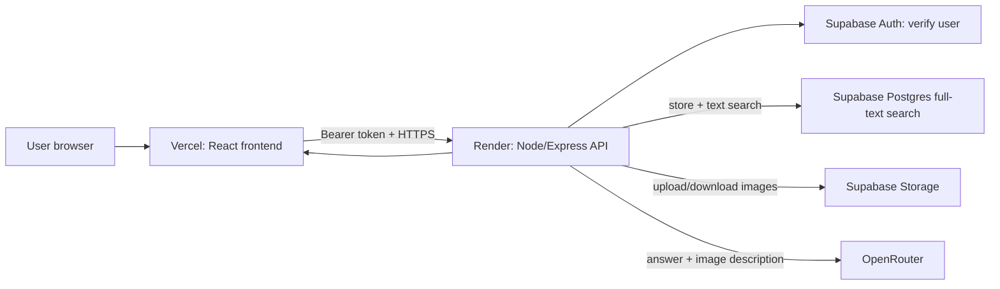

# Brain Hop API

The Brain Hop backend provides authenticated AI conversations, searchable chat
memory, image context, and chat merging.

This branch replaces the deployment-time Flask/Chroma/HuggingFace runtime with:

- Supabase Postgres full-text search for persistent, no-cost memory retrieval.
- OpenRouter's `openrouter/free` router for no-cost answer generation and image descriptions.
- Render Free for the Node API and Vercel for the React frontend.

The legacy `chatbot/` directory is rollback material only; it is not part of
the Node-only deployment.

## Data-flow diagram



## What is stored where

| Data | Location | Purpose |
| --- | --- | --- |
| Login/session | Supabase Auth | Identifies the current user. |
| Chat metadata and UI history | `chats` table | Restores sidebar and message history. |
| Searchable message chunks | `chat_memory_chunks` | Full-text retrieval without an embedding provider. |
| Uploaded images | `chat_vectors` Storage bucket | Image context, owned by the authenticated user. |
| OpenRouter API key | Render environment | Never sent to the browser. |

## Prerequisites

- Node.js 20 or later.
- A Supabase project with Auth and the existing `chats` table/bucket.
- An OpenRouter API key for chat generation.
- A Vercel deployment of the `Brain-Hop` frontend.

## Local setup

1. In `Brain-Hop-API`, copy `.env.example` to `.env`.

2. Fill in the values. `SUPABASE_KEY` is a server-only service-role key; do
   not use it in Vercel or in any `VITE_*` variable.

```text
SUPABASE_URL=https://your-project.supabase.co
SUPABASE_KEY=your_service_role_key
OPENROUTER_API_KEY=your_openrouter_key
FREE_MODEL=openrouter/free
PORT=3001
FRONTEND_URL=http://localhost:5173
CORS_ALLOWED_ORIGINS=http://localhost:8080
```

3. Install and start the API.

```powershell
npm ci
npm start
```

4. Verify the health check:

```text
http://localhost:3001/api/health
```

## Database migration

Before using chat memory, open Supabase Dashboard → SQL Editor and run:

```text
supabase/migrations/20260815_pgvector_chat_memory.sql
supabase/migrations/20260816_free_text_chat_memory.sql
```

Run them in that order. Together they create `chat_memory_chunks`,
enable RLS, replace vector storage with a PostgreSQL full-text index, and keep
the chat-copy function. They do not delete old Chroma ZIP artifacts.

## Existing chat backfill

Old Chroma vectors are not used. The backfill rebuilds searchable text rows
from persisted `chats.chat` JSON history.

```powershell
# Preview only
npm run backfill:memory

# Apply after reviewing preview output
npm run backfill:memory -- --apply
```

Keep old ZIP artifacts until sampled old chats pass UAT.

## Docker

Create `.env`, then run:

```powershell
docker compose up --build
```

The Node API runs on port `3001`. Docker Compose intentionally does not start
the legacy Python RAG service.

## Production deployment

### Render API

Deploy this repository using `render.yaml` or a Docker Web Service. Set the
variables above, with your Vercel production URL:

```text
FRONTEND_URL=https://your-project.vercel.app
CORS_ALLOWED_ORIGINS=https://app.yourdomain.com
```

Set the health-check path to `/api/health`. No `OPENAI_API_KEY` is needed.
Set `FREE_MODEL=openrouter/free` (or a specific model ending in `:free`) so
frontend model selections cannot incur paid OpenRouter usage.

### Vercel frontend

Set these Vercel variables in the `Brain-Hop` frontend project:

```text
VITE_SUPABASE_URL=https://your-project.supabase.co
VITE_SUPABASE_ANON_KEY=your_supabase_anon_key
VITE_API_BASE_URL=https://your-render-api.onrender.com
```

Only the Supabase anon key belongs in Vercel. Never expose service-role or
OpenRouter keys in frontend variables.

## Verification

```powershell
npm test
node --check server.js
```

For end-to-end validation, use [docs/FREE_TIER_UAT.md](docs/FREE_TIER_UAT.md).
For rollout, rollback, and backfill detail, use
[docs/PGVECTOR_MIGRATION.md](docs/PGVECTOR_MIGRATION.md).

## Security controls

- Protected routes verify the Supabase Bearer token and derive ownership from it.
- CORS accepts only configured exact frontend origins.
- Uploaded images have type and 5 MB limits.
- Chat rows, vectors, and image paths are scoped to the authenticated user.
- API credentials are runtime environment variables only.

## Free-tier note

Render Free can sleep after inactivity, so the first request after idle may be
slow. The API has no PyTorch, Chroma, local model, or embedding API dependency,
which removes the prior memory failure and the OpenAI embedding cost.
OpenRouter free models are rate-limited and can be unavailable, so this setup is
appropriate for personal use, testing, and low-volume demos rather than a
reliable public production service.
