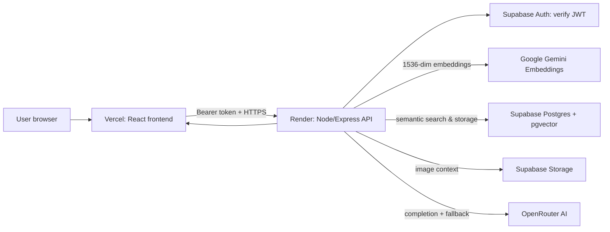

# 🧠 Brain Hop API

The **Brain Hop API** is a high-performance Node.js/Express backend that provides authenticated AI conversations, persistent semantic chat memory via **Retrieval-Augmented Generation (RAG)**, conversational chat merging, and image contextualization.

---

## 📚 System Architecture & Documentation

For complete technical specifications, DDL schemas, vector index designs, and sequence diagrams, please see:
* 📄 **[System Architecture & Design Document](docs/SYSTEM_ARCHITECTURE.md)** — In-depth architectural blueprint, component boundaries, RAG pipeline, and API specifications.
* 📄 **[pgvector Migration & Rollout Guide](docs/PGVECTOR_MIGRATION.md)** — Database setup, table definitions, and data migration instructions.
* 📄 **[Free Tier UAT & Verification](docs/FREE_TIER_UAT.md)** — Step-by-step acceptance testing checklist.

---

## ⚡ Key Highlights & Capabilities

- **Google Gemini Embeddings**: Generates 1536-dimensional Matryoshka vector embeddings (`gemini-embedding-001`) for semantic memory.
- **Supabase pgvector Store**: Fast Cosine Similarity search with HNSW vector indexing for user and conversation memory retrieval.
- **OpenRouter Multi-Model Gateway**: Seamless integration with the latest free-tier and premium LLMs (MiniMax, LiquidAI, Nemotron, Gemma, etc.) with automatic fallback resilience.
- **Granular & Bulk Deletion**: Supports individual chat deletion and instant whole-account history/memory purge (`DELETE /api/chats`).
- **Multi-Tenant Isolation**: Enforces strict user boundaries via Supabase JWT token verification and Row-Level Security (RLS).

---

## 🔄 High-Level Data Flow



---

## 🗄️ Storage & Entity Mapping

| Data Entity | Storage Location | Description |
| :--- | :--- | :--- |
| **Authentication & Tokens** | Supabase Auth | Identifies and authenticates active user sessions. |
| **Chat Metadata & UI Log** | `public.chats` | Restores conversation titles and message logs in the UI. |
| **Searchable Vector Memory** | `public.chat_memory_chunks` | Chunks embedded with 1536 dimensions for RAG retrieval. |
| **Image Context Attachments** | `chat_vectors` Storage bucket | Uploaded image files scoped to user paths. |
| **API Keys & Secrets** | Server `.env` | Server-only secrets; never exposed to client browsers. |

---

## 🚀 Getting Started Locally

### 1. Prerequisites
- Node.js 20 or later.
- A Supabase project with `pgvector` enabled and `chat_vectors` storage bucket created.
- A Google AI Studio API key (for Gemini embeddings).
- An OpenRouter API key.

### 2. Environment Setup
Create a `.env` file in the `Brain-Hop-API` directory (see `.env.example`):

```env
SUPABASE_URL=https://your-project.supabase.co
SUPABASE_KEY=your_service_role_key
OPENROUTER_API_KEY=your_openrouter_key
GEMINI_API_KEY=your_google_ai_studio_key
GEMINI_EMBEDDING_MODEL=gemini-embedding-001
PORT=3001
FRONTEND_URL=http://localhost:5173
CORS_ALLOWED_ORIGINS=http://localhost:8080
```

### 3. Install & Start Server
```powershell
npm install
npm start
```
> Server runs on `http://localhost:3001`. Confirm health at `http://localhost:3001/api/health`.

---

## 🗃️ Database Migration

Run the SQL migration in your Supabase SQL Editor before starting the service:

```sql
-- Located in supabase/migrations/20260815_pgvector_chat_memory.sql
```

To backfill embeddings for older conversations:
```powershell
# Preview only (dry-run)
npm run backfill:memory

# Apply migration
npm run backfill:memory -- --apply
```

---

## 🧪 Testing & Verification

```powershell
# Run backend test suite
npm test

# Syntax verification
node --check server.js
```
