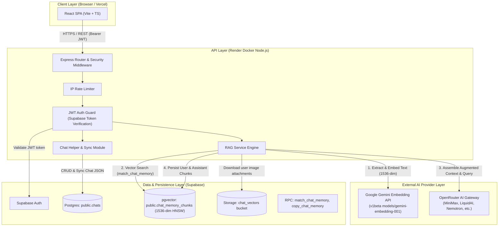

# Brain Hop API - System Architecture & Design Document

## 1. System Overview

**Brain Hop API** is a high-performance, stateless Node.js/Express backend that powers multi-model contextual AI chats, persistent semantic memory via **Retrieval-Augmented Generation (RAG)**, conversational chat merging, and image context understanding.

The architecture is built for serverless/containerized deployment (Render Free Tier) paired with a Supabase managed PostgreSQL instance using `pgvector` and external AI providers (Google Gemini for embeddings and OpenRouter for LLM inference).

---

## 2. High-Level Architecture Diagram



---

## 3. Core Subsystems & Components

### 3.1 Authentication & Multi-Tenant Isolation
* **Token Verification**: Every protected route verifies incoming Supabase JWT tokens via `assertRequestedUser` / `requireAuth` in `src/middleware/auth.js`.
* **Tenant Scoping**: All database queries enforce strict tenant separation by constraining queries on `user_id = req.user.id`.
* **Row-Level Security (RLS)**: PostgreSQL tables have RLS policies ensuring users can only read and modify their own records.

### 3.2 RAG Engine & Embedding Pipeline
* **Chunking**: Text is split into clean chunks (default 900 chars with 150-char overlap) via `splitText()`.
* **Embedding Generation**: Chunks are embedded using Google Gemini's REST API (`gemini-embedding-001`).
  * **Matryoshka Truncation**: Explicitly configured for 1536 dimensions (`outputDimensionality: 1536`) to match the PostgreSQL `vector(1536)` column definition.
  * **Task Types**: Uses `RETRIEVAL_DOCUMENT` for message chunk storage and `RETRIEVAL_QUERY` for runtime queries.
* **Vector Retrieval**: Queries call the stored procedure `match_chat_memory(query_embedding, filter_user_id, filter_chat_ids, match_count)` which calculates cosine similarity ($1 - (\text{embedding} \Leftrightarrow \text{query\_embedding})$) over an HNSW index.

### 3.3 LLM Routing & Dynamic Fallback Resilience
* **Model Choice**: Users choose any supported model from the frontend.
* **Fallback Strategy**: If an OpenRouter model returns HTTP 404 (model discontinued/converted to paid), 400, or 429, the system automatically falls back through a verified list of active free-tier models:
  1. `minimax/minimax-m2.7:free`
  2. `liquid/lfm-2.5-2.6b:free`
  3. `inclusionai/ling-3.0-flash-fin:free`
  4. `nvidia/nemotron-3.5-lightning:free`
  5. `minimax/minimax-m3:free`

---

## 4. Database Schema & Stored Procedures

### 4.1 `public.chats` Table
Stores high-level chat metadata and serialized message history for fast UI restoration.

```sql
CREATE TABLE public.chats (
  id uuid PRIMARY KEY DEFAULT gen_random_uuid(),
  chat_id uuid NOT NULL,
  user_id uuid NOT NULL REFERENCES auth.users(id) ON DELETE CASCADE,
  title text NOT NULL DEFAULT 'New Conversation',
  zip_file_url text DEFAULT '',
  vector_count integer DEFAULT 0,
  chat jsonb,
  created_at timestamptz NOT NULL DEFAULT now(),
  updated_at timestamptz NOT NULL DEFAULT now(),
  UNIQUE(user_id, chat_id)
);
```

### 4.2 `public.chat_memory_chunks` Table
Stores semantic text chunks and their 1536-dimensional embeddings.

```sql
CREATE TABLE public.chat_memory_chunks (
  id uuid PRIMARY KEY DEFAULT gen_random_uuid(),
  user_id uuid NOT NULL REFERENCES auth.users(id) ON DELETE CASCADE,
  chat_id uuid NOT NULL,
  message_key text NOT NULL,
  role text NOT NULL CHECK (role IN ('user', 'assistant', 'system')),
  content text NOT NULL,
  chunk_index integer NOT NULL CHECK (chunk_index >= 0),
  embedding extensions.vector(1536) NOT NULL,
  metadata jsonb NOT NULL DEFAULT '{}'::jsonb,
  created_at timestamptz NOT NULL DEFAULT now(),
  UNIQUE (chat_id, message_key, chunk_index)
);

CREATE INDEX chat_memory_chunks_user_chat_idx
  ON public.chat_memory_chunks (user_id, chat_id, created_at DESC);

CREATE INDEX chat_memory_chunks_embedding_idx
  ON public.chat_memory_chunks USING hnsw (embedding extensions.vector_cosine_ops);
```

### 4.3 Stored Procedures
* **`match_chat_memory`**: Executes Cosine Similarity search filtered by user ID and active chat IDs.
* **`copy_chat_memory`**: Copies and re-indexes memory chunks from multiple source chats into a merged chat for seamless contextual synthesis.

---

## 5. API Reference Summary

| Method | Endpoint | Auth | Purpose |
| :--- | :--- | :--- | :--- |
| `GET` | `/api/health` | None | Health status & Supabase DB connectivity check |
| `POST` | `/api/auth/session` | None | Exchanges OAuth tokens for verified user session |
| `POST` | `/api/auth/logout` | Optional | Server-side logout hook |
| `POST` | `/api/rag/chat` | Bearer JWT | Executes RAG retrieval, LLM completion, and chunk storage |
| `POST` | `/api/rag/image` | Bearer JWT | Uploads image to `chat_vectors` bucket and returns image ID |
| `POST` | `/api/rag/merge_chats` | Bearer JWT | Merges multiple source chats into a unified conversation |
| `GET` | `/api/chats` | Bearer JWT | Returns all chats for the authenticated user |
| `POST` | `/api/chats/save` | Bearer JWT | Upserts a single chat session |
| `POST` | `/api/chats/sync` | Bearer JWT | Batch synchronizes pending local chats |
| `DELETE` | `/api/chats/:chatId` | Bearer JWT | Deletes single chat, its memory chunks, and storage images |
| `DELETE` | `/api/chats` | Bearer JWT | Wipes all chats and memory chunks for user |

---

## 6. Environment Configuration

```properties
SUPABASE_URL=https://<project-ref>.supabase.co
SUPABASE_KEY=<service_role_key>
OPENROUTER_API_KEY=<openrouter_api_key>
GEMINI_API_KEY=<google_ai_studio_api_key>
GEMINI_EMBEDDING_MODEL=gemini-embedding-001
PORT=3001
FRONTEND_URL=http://localhost:5173
CORS_ALLOWED_ORIGINS=http://localhost:8080
```
